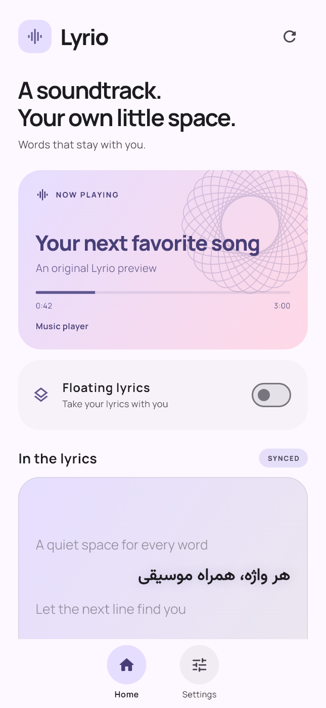
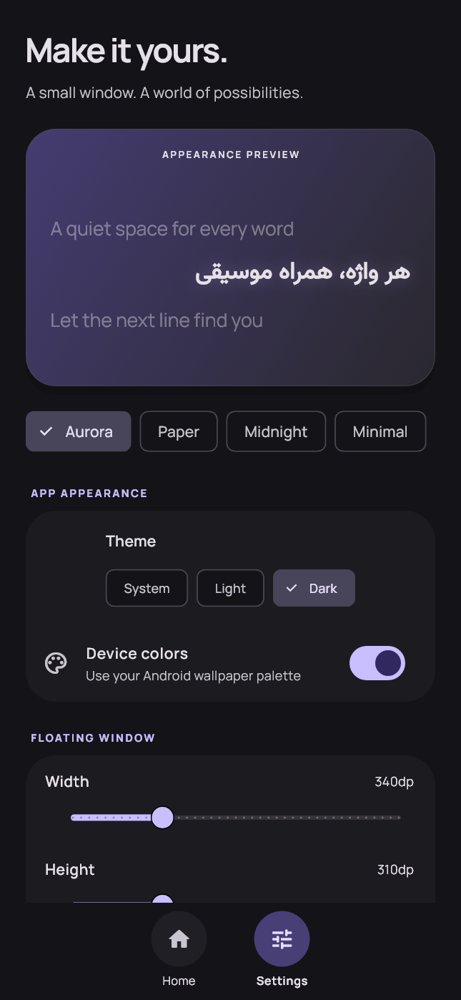

# Lyrio

**Your music, in words.** A small Android lyrics companion with a movable Flutter window that follows the song playing in another app.

Package: **com.mbn.lyrio** · **Android 8+ / ARM64 only** · Flutter **3.47.5** / Dart **3.13.4**

## What works

- Two pages, Home and Settings, with swipe navigation and circular navigation buttons.
- Material 3, device wallpaper accent on Android 12+, light/dark themes and custom accent colors.
- Native media-session callbacks for track changes, pause/resume, playback speed and seeking. A media-notification fallback handles players that do not expose a session; without a clock, lyrics use full-text mode.
- An independent foreground service owns the floating Flutter engine. Removing the activity from Recents does not intentionally stop the service.
- Synchronized LRC, animated focus lines, automatic scrolling in full mode, adjustable timing offset, and complete scrollable unsynchronized lyrics.
- Drag, collapse, close, remembered position, size, opacity, corners, text size, spacing, alignment, transitions, active-line glow and pause behavior.
- Bundled Manrope and Vazirmatn; automatic Persian/Arabic line direction. The app interface is English.
- LRCLIB, Lyrics.ovh, optional Musixmatch developer key, and multiple custom HTTPS JSON providers with configurable fields/authentication.
- Android Keystore encrypted API keys, a bounded public-provider cache, sequential network requests and rate-limit cooldowns.
- No microphone access, analytics or advertisements.

 

Images use original test text, not a user's listening data.

## Run on your phone

Enable USB debugging and authorize the computer. From this folder:

```powershell
.\scripts\debug-phone.ps1
```

Or double-click **debug-phone.cmd**. The script checks for Android API 26+ and ARM64, builds only `android-arm64`, and opens an interactive debug session.

- `r`: hot reload
- `d`: detach and leave the application running
- `q`: end the Flutter run session

For installation without a debugger:

```powershell
.\scripts\debug-phone.ps1 -InstallOnly
.\scripts\debug-phone.ps1 -InstallOnly -SkipBuild
.\scripts\debug-phone.ps1 -DeviceId YOUR_SERIAL
```

The script prefers the local `.tooling/flutter` SDK when present; otherwise it uses Flutter on PATH. A fresh clone needs Flutter 3.47.5, JDK 17 or 21, Android SDK 36, NDK 28.2.13676358 and accepted Android SDK licenses. The local SDK is ignored by Git. The global Flutter installation was not upgraded.

## First launch

Use the access cards on Home to grant **Notification access**, **Display over other apps** and **Service notifications**. Then enable **Floating lyrics**. Every permission uses the normal Android settings flow. Battery exemption is optional.

On Android 13+ sideloaded apps, Android may block notification access until you open App info, the overflow menu and **Allow restricted settings**. Vendor Autostart/unrestricted battery options may also be needed.

Play a song in a compatible player. Change tracks, pause and seek to check synchronization. See [the phone test checklist](docs/PHONE_TEST.md).

## Providers

The app works without registration using LRCLIB and Lyrics.ovh. Musixmatch requires your own developer key and its plan may return previews or deny lyrics. Custom endpoints can be added under Settings → Lyrics sources → Add your own API.

See [provider setup and contract](docs/API_PROVIDERS.md). No keys are bundled or committed. This is a set of supported providers and an extension mechanism, not a claim that every lyrics API on the internet is free or unrestricted.

## Verify and build

```powershell
.\scripts\verify.ps1
```

Equivalent Flutter commands:

```text
flutter pub get
flutter analyze
flutter test --reporter expanded
flutter build apk --debug --target-platform android-arm64
```

On Windows, `scripts/lint-android.ps1` runs Android Lint and normalizes the generated local SDK paths that otherwise trigger PropertyEscape errors.

Debug APK: `build/app/outputs/flutter-apk/app-debug.apk`. Build configuration also filters native libraries to `arm64-v8a`; there are no 32-bit APK targets. Dart unit/widget tests execute on the host, not a phone CPU.

Debug signing is for local testing. Store distribution needs your release keystore, provider licensing review and the foreground-service special-use declaration. No production signing keys are included.

## Architecture

- `lib/core`: snapshot bridge, LRC parsing, timeline selection and theme.
- `lib/ui`: Home, Settings, provider forms and shared lyric renderer.
- `lib/overlay`: the service's independent Flutter entrypoint.
- `android/.../LyrioCore.kt`: media controller callbacks and background lyric orchestration.
- `android/.../LyricsProviders.kt`: network adapters, matching, cooldown and bounded cache.
- `android/.../LyrioOverlayService.kt`: foreground notification and draggable Flutter window.
- `android/.../KeyVault.kt`: AES-GCM keys backed by Android Keystore.

The Android listener ignores non-media notifications. Only song title, artist, album and duration are sent to selected providers. No listening history is stored. The lyric service has no dependency on a live Activity.

## Platform limits

Players must expose usable media metadata. Android/vendor process policies can interrupt any app; **Force stop always wins**. Reopen Lyrio after a force stop or reboot. Removing the app from Recents is different from Force stop. See [Android details](docs/ANDROID_LIMITS.md).

This first build needs real-phone verification of overlay lifecycle, OEM battery behavior and music-player interoperability. Automated tests do not certify those behaviors.

## Licenses

Application code: MIT. Fonts: SIL Open Font License, bundled in `assets/fonts` and listed in the app. Lyrics retain their providers' and rights holders' terms; the app contains no song catalog.
